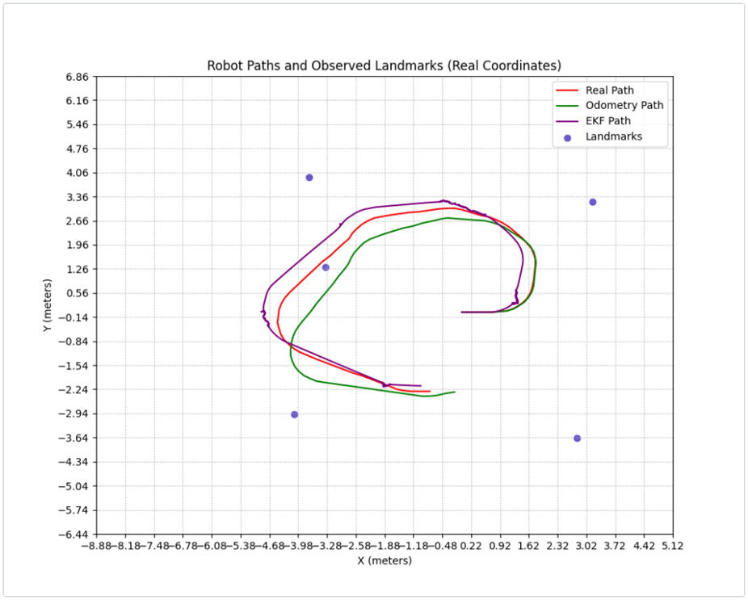
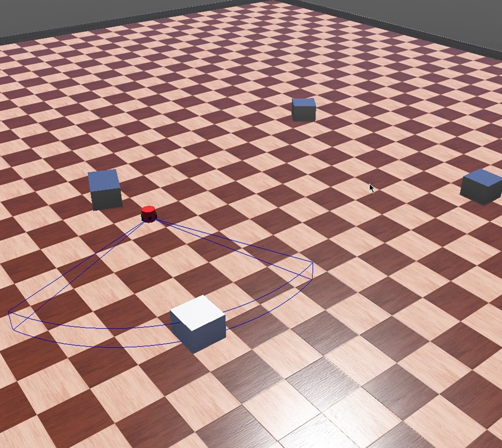

# EKF-SLAM (Unknown Correspondence) — Differential Drive + Range–Bearing Sensor

This repository implements **2D EKF-SLAM** for a **differential-drive robot** equipped with a forward **range–bearing (“radar”) sensor**. The system jointly estimates the **robot pose** and a **landmark map** while resolving **unknown data association** using **Mahalanobis-distance gating**.

---

## System overview

The project consists of:
- A **2D interactive simulation** (teleoperated differential-drive robot).
- A simplified **range–bearing sensor model** with a forward field-of-view.
- An **EKF-SLAM backend** that performs prediction, association, landmark initialization, and correction.
- Visualization of **trajectories** and **landmark estimates**.

---

## Python implementation (2D simulation)

This section covers the Python-based 2D simulation and EKF-SLAM pipeline: differential-drive motion, simulated range–bearing sensing, and the full SLAM loop producing pose + map estimates.

### Differential-drive motion model
- Robot motion is modeled with standard **unicycle/differential-drive kinematics**.
- Pose propagation uses a discrete integration scheme (e.g., **RK4**) to reduce numerical error during simulation.

### Range–bearing observation model
- Landmarks are observed as **(range, bearing)** relative to the robot frame.
- Measurements are modeled with **zero-mean Gaussian noise** and a configurable covariance.

### EKF-SLAM state representation
- The filter maintains a joint Gaussian over:
  - the **robot pose** (position + heading), and
  - the **2D positions of all landmarks**
- The full covariance preserves:
  - robot uncertainty,
  - landmark uncertainty, and
  - robot–landmark cross-correlations.

### EKF-SLAM pipeline (algorithmic structure)

**1) Prediction**
- Propagates the robot pose using the motion model and control inputs.
- Updates the joint covariance using the **motion Jacobian** and **motion noise**.

**2) Data association (unknown correspondence)**
- For each measurement, predicted observations are generated for all existing landmarks.
- Candidate matches are scored using **Mahalanobis distance** (innovation weighted by its covariance).
- **Nearest-neighbor gating**:
  - best match within threshold → associate
  - otherwise → treat as a **new landmark**

**3) Landmark initialization (state augmentation)**
- Unassociated measurements initialize new landmarks by projecting range–bearing into the global frame.
- The state vector and covariance are **expanded** to include the new landmark and its uncertainty.

**4) Correction (EKF update)**
- Associated measurements update the joint state using the standard EKF correction:
  - innovation, innovation covariance, Kalman gain, state/covariance update.

---

## Code organization (high-level)

- `main.py` — orchestrates the simulation + EKF-SLAM loop and produces plots  
- `live_simulation.py` — interactive visualization and environment/landmark setup  
- `motion_and_radar.py` — differential-drive kinematics, integration, sensor/visibility logic  
- `ekf_slam.py` — EKF prediction, association, landmark initialization (augmentation), and update  
- `general_functions.py` — helpers (angle wrapping, utilities)

---

## Extension: from 2D simulation to 3D (Webots)

An extension of this work was explored in **Webots** to validate the same concepts in a **physics-based 3D simulator**. The goal is to preserve the EKF-SLAM structure while replacing the 2D simulated sensor and odometry with Webots-provided robot sensors and dynamics.

---

## References

- S. Thrun, W. Burgard, D. Fox — *Probabilistic Robotics*
- Standard EKF-SLAM derivations for range–bearing landmark SLAM
